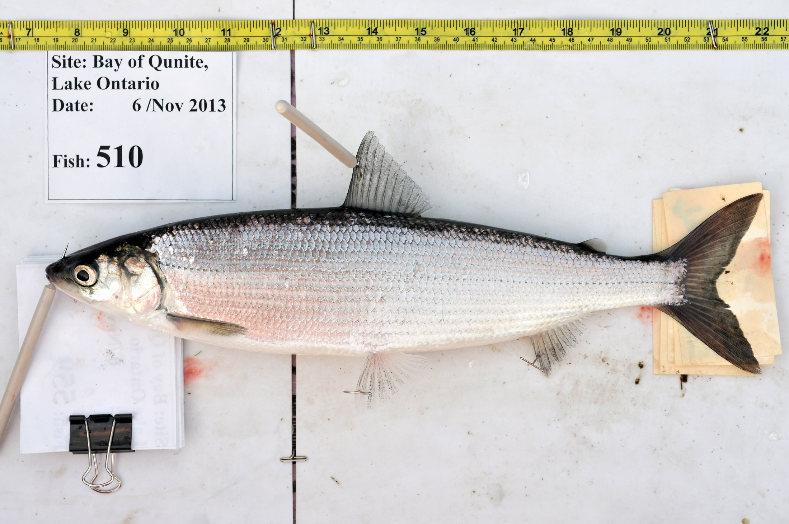
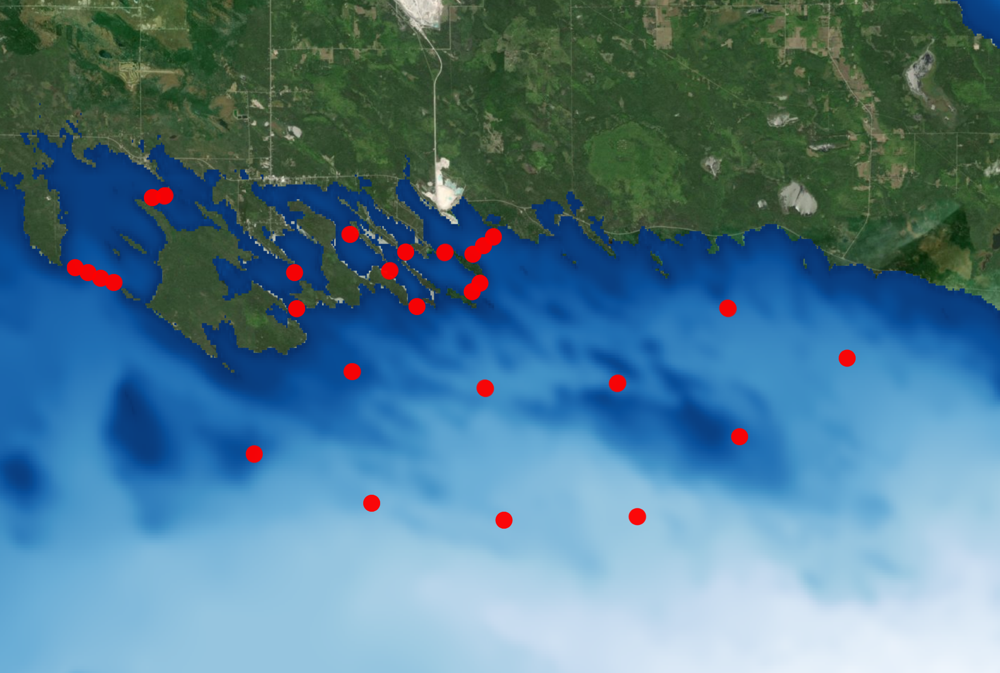
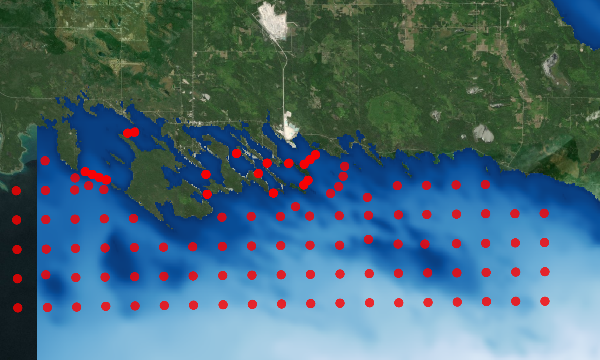

class: title-slide, center

<!-- see for helpful tips:
https://nbisweden.github.io/raukrtemplate/presentation_demo.html#1
https://github.com/yihui/xaringan/wiki
-->


# Travelogue of Les Cheneaux Island cisco

</br>

## Todd Hayden, Chris Holbrook, Dave Fielder, Chris Olds, Tom Binder, Aaron Fisk

.center[]


<div class="flex2">
   
   
   
   
   
   
</div>

---

class: top, center

# Acknowledgments

.left[
- Hammond Bay Biological Station
- Great Lakes Acoustic Telemety Observataion System
- Michigan State University
- US Geological Survey
- Michigan Department of Natural Resources
- US Fish and Wildlife
- Real-Time Aquatic Ecosystem Observation Network
- Sault Ste. Marie Tribe of Chippewa Indians
- Great Lakes Restoration Initiative
- Great Lakes Fishery Commission
]


<div class="flex2">
    
	
	
    
   	
	
	
	
	
</div>
	
---

class: top, center

# What is a cisco?

.left[
- Scientific name: *Coregonus artedi*
- Common names: lake herring, tullibee, blue-back, green-back
- Spawn in Nov-December on rocky shoals, hatch in April
- Mature in 3-4 years
- Adults are pelagic, form schools
- Eat plankton, insects, eggs
- Extensive commercial fishery (mid 1800's)
]

<div class="flex2">
	
	
	
</div>

.footnote[
*photos by Andrew Muir*

]

---

class: top, center

# Cisco fishery in Great Lakes

</br>
</br>

<div class="flex2">
	
    
	
</div>


---
class: top, center

# Cisco in Lake Huron?
.left[
- Contemporary distribution limited to northern Lake Huron
- Recreational fishery in Les Cheneaux Islands
- "Coastal" population
]

.pull-left[

```{r echo = FALSE, fig.height=6, fig.width=7}

library(leaflet)
zoom <- 6.5
m <- leaflet(options = leafletOptions(zoomControl = FALSE, minZoom = zoom, maxZoom = zoom, dragging = FALSE))
m <- setView(m, lng = -82.8, lat = 44.5, zoom = zoom)
m <- addProviderTiles(m, providers$Esri.WorldShadedRelief)
m <- addRectangles(m, lng1=-84.588855, lat1=46.046458, lng2=-84.2, lat2=45.862240, fillColor = "transparent", color = "red", opacity = 1)
m

```
]

.pull-right[

```{r echo = FALSE, fig.height=6, fig.width=7}

zoom <- 11
m <- leaflet(options = leafletOptions(zoomControl = FALSE, minZoom = zoom, maxZoom = zoom, dragging = FALSE))

m <- setView(m, lng = -84.35, lat = 45.947755, zoom = zoom)
m <- addProviderTiles(m, providers$Esri.WorldImagery, group = "satellite")
#fm <- addRectangles(m, lng1=-84.588855, lat1=46.046458, lng2=-84.2, lat2=45.862240, fillColor = "transparent", color = "red", opacity = 1)
m

```
]

---
class: top, center

# Why have cisco populations declined?

.left[
- Overharvest
]

</br>

<div class="flex2">
	
    
	
</div>

---
class: top, center

# Why have cisco populations declined?

.left[
- .grey[Overharvest]
- Industrialization and habitat degradation
  - low dissolved oxygen (1950-1960s)
]

<div class="flex2">
	
	
	
</div>

---

class: top, center

# Why have cisco populations declined?

.left[
- .grey[Overharvest]
- .grey[Industrialization and habitat degradation]
- Invasive species
]

<div class="flex2">
	
	
	
	
</div>
	
---

class: top, center

# Goal: restore cisco in Saginaw Bay

.left[
- Hatchery culture and stocking 
    - US Fish and Wildlife Service
	- National Fish Hatchery System
- Les Cheneaux Islands - source of gametes for hatchery
]

.pull-left[

```{r echo = FALSE, fig.height=5, fig.width=7}
zoom <- 11
m <- leaflet(options = leafletOptions(zoomControl = FALSE, minZoom = zoom, maxZoom = zoom, dragging = FALSE))

m <- setView(m, lng = -84.35, lat = 45.947755, zoom = zoom)
m <- addProviderTiles(m, providers$Esri.WorldImagery, group = "satellite")
#m <- addRectangles(m, lng1=-84.588855, lat1=46.046458, lng2=-84.2, lat2=45.862240, fillColor = "transparent", color = "red", opacity = 1)
m

```
]

.pull-right[

```{r echo = FALSE, fig.height=5, fig.width=7}

zoom <- 8
m <- leaflet(options = leafletOptions(zoomControl = FALSE, minZoom = zoom, maxZoom = zoom, dragging = FALSE))

m <- setView(m, lng = -83.2, lat = 43.96761, zoom = zoom)
m <- addProviderTiles(m, providers$Esri.WorldImagery, group = "satellite")
m <- addRectangles(m, lng1=-83.957248, lat1=44.279261, lng2=-82.901314, lat2=43.551431, fillColor = "transparent", color = "red", opacity = 1)
m

```
]


---

class: top, center

# Goal: restore cisco in Saginaw Bay
.center[
## .red[Establish "coastal" cisco in "offshore" Saginaw Bay]
]

.pull-left[

```{r echo = FALSE, fig.height=6, fig.width=8}
zoom <- 11.5
m <- leaflet(options = leafletOptions(zoomControl = FALSE, minZoom = zoom, maxZoom = zoom, dragging = FALSE))

m <- setView(m, lng = -84.35, lat = 45.947755, zoom = zoom)
m <- addProviderTiles(m, providers$Esri.WorldImagery, group = "satellite")
#m <- addRectangles(m, lng1=-84.588855, lat1=46.046458, lng2=-84.2, lat2=45.862240, fillColor = "transparent", color = "red", opacity = 1)
m

```
]

.pull-right[

```{r echo = FALSE, fig.height=6, fig.width=8}

zoom <- 8.5
m <- leaflet(options = leafletOptions(zoomControl = FALSE, minZoom = zoom, maxZoom = zoom, dragging = FALSE))

m <- setView(m, lng = -83.2, lat = 43.96761, zoom = zoom)
m <- addProviderTiles(m, providers$Esri.WorldImagery, group = "satellite")
m <- addRectangles(m, lng1=-83.957248, lat1=44.279261, lng2=-82.901314, lat2=43.551431, fillColor = "transparent", color = "red", opacity = 1)
m

```
]

---

class: top, center

# Why restore cisco?
.left[
- High energy prey resource
- Transfer energy from primary production to top of food web
- Commercial and recreational fisheries
]

.center[]

---

class: top, center

# Why now?

.left[
- Habitat restoration- dissolved oxygen not limiting
- Invasive species control
  - Alewife
  - Sea lamprey
- Successful restoration of walleye in Saginaw Bay
- Re-establish trophic linkages 
]


<div class="flex2">
	
	
	
</div>


---

class: top, center

# Questions

.left[
- Do cisco from the Les Cheneaux Islands move offshore into Lake Huron?
- What proportion of tagged cisco survive?
]

--

# Methods

.left[
- Tagged 25 cisco from Government Bay (November 2018; ~ 400 mm TL)
- Deployed 28 receivers in Les Cheneaux Islands, Lake Huron
- Tracked movements ~ 1 year
]


---

class: top, center, split-two

# Les Cheneaux Islands cisco tagging

.column[


]

.column[
<video width="420" height="320" autoplay muted loop >
	<source src="images/tagged_cisco_in_recovery_01_cholbrook_20181108.mp4" type="video/mp4">
</video>
]


---
class: top, center, split-two

# Les Cheneaux Islands receiver deployments

.column[
	

]

.column[
	
	
]
	
---

class: top, center
 
# Great Lakes Acoustic Telemetry Observation System

.left[
- Network of researchers who collaboratively use acoustic telemetry
- Understand fish behavior in Great lakes ecology
- Provide information useful to fish managers 
- .red[Framework to share detections]
- https://glatos.glos.us
]

.pull-left[


]

.pull-right[


]

---

class: top, center

background-image: url("images/animation.gif")
background-size: cover

# Cisco movements

---

class: top, center

background-image: url("images/monthly_dtc.gif")
background-size: cover

# Acoustic detections- month

---

class: top, center

background-image: url("images/overall.png")
background-size: cover

# Acoustic detections November 2018 - September 2019

---

class: top, center

# Results

.left[
- Offshore movements in summer and fall
  - Recreational fishery in Les Cheneaux Islands
  - obtain prey resources
  - water temperature
- Survival 
  - 84% fish moved through June 2019
- Overwinter in Les Cheneaux Islands
]

--

# Take home messages

.left[
1. .red[ Preliminary acoustic telemetry data suggest cisco move offshore. Stocked cisco adapt to Saginaw Bay?]
2. .red[Cisco can be tagged sucessfully]
3. .red[Winter potential opportunity to capture cisco in Les Cheneaux Islands?]
]

---

class: top, center

# Next steps...

.left[
- Tag more fish in 2019, 2020
- Expand acoustic receiver array
]

.image-60[]

---

class: top, center

# Additional information

.small[
http://www.glfc.org/pubs/misc/Ciscoes_of_the_Laurentian_Great_Lakes_and_Lake_Nipigon.pdf
]

<div class="box">
	
</div>


